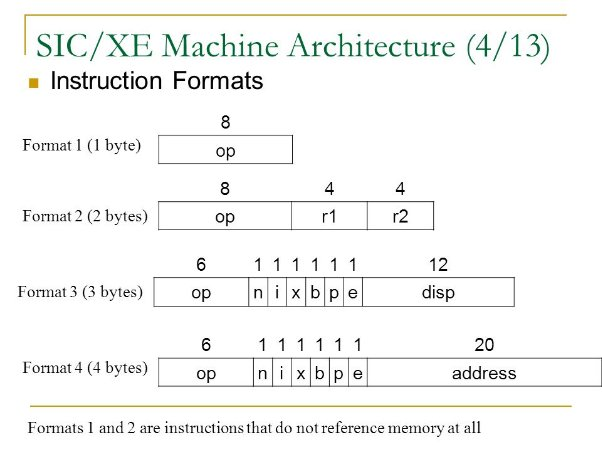

***SIC-XE ASSEMBLER***

*-CPP implementation* 

**PROJECT INTRODUCTION**

` `In this project I am implementing a two pass SIC/XE assembler: Pass 1 and Pass2.

` `The Assembler I have made includes all the SIC/XE instructions and supports all the four formats of an assembler: 

● Format 1

● Format 2 

● Format 3

● Format 4

**Different types of Addressing modes**

` `● Extended (e=1 means format 4, e=0 means format 3). For Format 4 a ‘+’ sign is added in front of the opcode mnemonics.

` `● Indirect addressing: When n=1, i=0 and x=0.

` `● Index Based Addressing: x=1 rest n and i can be 0 or 1. 

● Immediate Mode of Addressing: When n=0, i=1 and x=0. 

● Direct Mode of Addressing: When n=1, i=1, b=0 and p=1. 

● Program counter relative addressing: When n=1, i=1, b=0, p=1.

` `● Base relative: When n=1, i=1, b=1 and p=0

**Features Implemented-**

1\. Literals 

2\. Symbol Defining Statements 

3\. Expressions

` `4. Control Section

**INPUT PROVIDED TO THE ASSEMBLER –**

A .txt file which contains our source program using the SIC/XE.

**Output Displayed-**

On executing pass2.exe we will get the following files:

- Pass 1 is generating a Symbol table that will store the label name and their corresponding address. 
- Pass 1 will generate an Intermediate file for Pass2.cpp
- Pass 2 will generate a listing file which contains the assembly code, their address and the corresponding object code of each instruction. 
- Pass 2 will generate an object code which will include Header Record, Text Record, End Record and the Modification Record. 
- It will also generate an error file to output any error(if any).

We have implemented the assembler in C++11 and we have used input, output file streams to read data from the input file and write it on the output files

**How to compile and execute the program?**

•	Download the zip file and open the terminal.

•	Compile the file pass2.cpp using the command g++ -std=c++11 pass2.cpp.

•	Put the executable pass2.exe and the test inputs in the same folder.

•	Now change the directory to Test\_inputs and execute the executable pass2.exe.

•	Write the name of the file you want to run in the given space.

•	And when we are done, 4 folders will be created corresponding to the error file, intermediate file, listing file and object code.

**Data Structures used in the implementation**

` `***Map*** 

Maps come under the STL (Standard Template Library in C++). 

Maps are associative containers that store elements in a mapped fashion. Each element has a key value and mapped value. 

Map is to store SYMBOL TABLE, OPCODE TABLE, CONTROL SECTIONS, REGISTER TABLE, LITERAL TABLE 

The map is of the type map which maps a string and a mapped value which is a struct that stores information of the element

` `***Struct***

Struct is a collection of different variables of different data types under a single type.

***LITTAB***

This struct represents the information of a literal like its value, the address of the literal, it’s address and a character to display whether a literal exists or not

***REGTAB***

It contains all the information of the register i.e., the numeric equivalent of the register, a character to store whether the register will exist or not.

***OPTAB***

It will contain all the information related to the opcode like the name of the opcode, its format and a character to represent whether it will exist or not.

***SYMTAB***

It will contain the information of labels like name, its address, its block number, a character which represents whether a label exists or not in the symbol table. And an integer to represent whether the label is relative or not.

